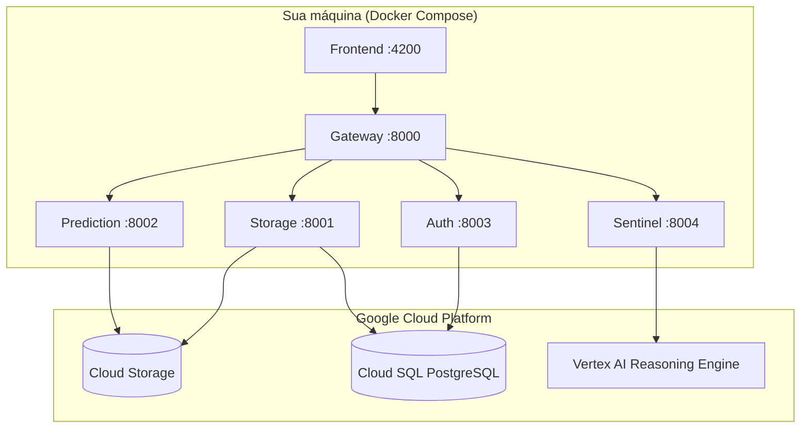
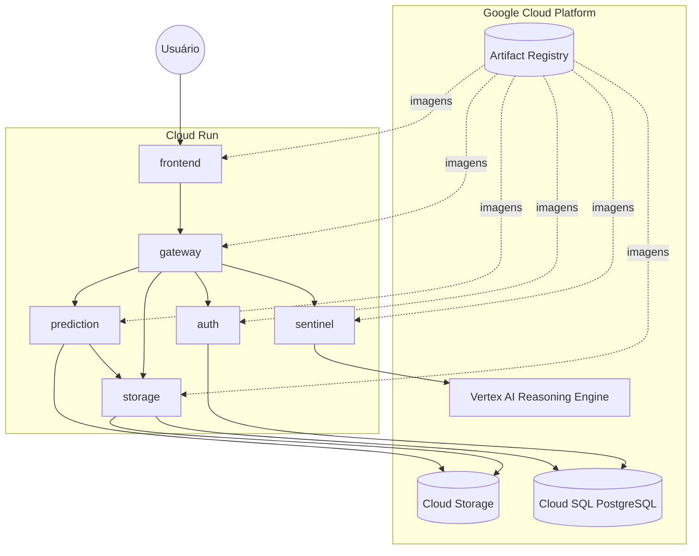

<div align="center">


# Plataforma de Engenharia de Dados e IA para o cuidado preventivo da diabetes no trajeto urbano de São Paulo

**TCC — <a href="https://www.fiap.com.br/mba/mba-em-engenharia-de-dados">MBA em Engenharia de Dados</a> · FIAP · Discovery (Case )**

Professor orientador: Tiago Petroni Taveira

| Integrante | RM | GitHub |
|---|---|---|
| Marcela Bento do Vale | 361949 | [marcelabvale](https://github.com/marcelabvale) |
| Pedro Henrique Cozzati Camillo | 361284 | [PedroCozzati](https://github.com/PedroCozzati) |
| Thomaz Colalillo Navajas | 140560 | [NavajasThomaz](https://github.com/NavajasThomaz) |
| Yasmin Martins Vasconcellos | 363354 | [yamars-dev](https://github.com/yamars-dev) |

</div>

##### <div align="center"><a href=https://youtu.be>🖥️Link para Video de pitch.🖥️</a></div>


## Sobre o projeto

O **Trajeto Saúde** é uma plataforma de microserviços que integra dados urbanos, modelos de machine learning e IA generativa (Vertex AI) para apoiar o cuidado preventivo de pacientes com diabetes em São Paulo.

A aplicação é composta por:

| Serviço | Porta | Responsabilidade |
|---|---:|---|
| **frontend** | 4200 | Interface Angular |
| **gateway** | 8000 | API unificada e roteamento |
| **auth** | 8003 | Autenticação JWT e usuários |
| **storage** | 8001 | Cloud Storage e Cloud SQL |
| **prediction** | 8002 | Pipeline de dados e predição de risco |
| **sentinel** | 8004 | Chat Sentinel.AI (Vertex Reasoning Engine) |

### Arquitetura



---

## Pré-requisitos

### Obrigatórios (todos os fluxos)

| Ferramenta | Versão mínima | Verificação |
|---|---|---|
| [Docker Desktop](https://www.docker.com/products/docker-desktop/) | 24+ | `docker --version` |
| [Terraform](https://developer.hashicorp.com/terraform/install) | 1.5+ | `terraform version` |
| [Google Cloud SDK](https://cloud.google.com/sdk/docs/install) | atual | `gcloud version` |
| Conta [Google Cloud](https://cloud.google.com/) | com billing ativo | — |

Na **Opção A (Cloud Run)**, o Docker é usado apenas para *buildar* as imagens antes do push ao Artifact Registry — a aplicação em si roda inteiramente no GCP, sem containers locais em execução. Nas opções B e C, o Docker também executa a stack localmente (`docker compose up`).

### Adicionais apenas para as Opções B/C (Docker Compose local)

| Ferramenta | Versão mínima | Verificação |
|---|---|---|
| [Docker Compose](https://docs.docker.com/compose/) | v2+ | `docker compose version` |

### Serviços GCP utilizados

| Serviço | Obrigatório | Finalidade |
|---|---|---|
| **Cloud SQL** (PostgreSQL) | Sim | Usuários e dados da aplicação |
| **Cloud Storage** | Sim* | Artefatos de modelo e pipeline |
| **IAM / Service Account** | Sim | Autenticação dos microserviços |
| **Cloud Run** | Apenas na Opção A | Execução dos microserviços na nuvem |
| **Artifact Registry** | Apenas na Opção A | Armazena as imagens Docker publicadas |
| **Vertex AI** (Reasoning Engine) | Não | Chat Sentinel.AI (opcional) |

\* Com `MODEL_SOURCE=local` (Opções B/C), o bucket é opcional para rodar predições, mas ainda é usado pelo pipeline de ingestão. Na Opção A, o `prediction` sempre usa `MODEL_SOURCE=gcs`.

---

## Escolha o fluxo de execução

Existem **três formas** de executar o projeto:

| | Opção A — Full GCP / Cloud Run (principal) | Opção B — Terraform + Docker local | Opção C — Configuração manual |
|---|---|---|---|
| **Onde os containers rodam** | Cloud Run (GCP) | Docker na sua máquina | Docker na sua máquina |
| **Para quem** | Quer a aplicação publicada e acessível por URL, sem depender da máquina local | Quer reproduzir tudo localmente com um comando | Já tem recursos GCP ou prefere o console |
| **Infra GCP** | Criada automaticamente (+ imagens publicadas no Artifact Registry) | Criada automaticamente | Criada manualmente no console |
| **Configuração da app** | Variáveis injetadas direto nos serviços Cloud Run pelo Terraform | Arquivo `.env` gerado por script | `.env` copiado e editado à mão |
| **Tempo estimado** | ~20–25 min (inclui build e push das imagens) | ~15 min (inclui Cloud SQL) | ~30 min |

---

## Opção A — Full GCP / Cloud Run (principal)

Toda a stack roda no GCP: Cloud SQL, Cloud Storage e os 6 microserviços publicados como serviços **Cloud Run** (sem depender de Docker local em execução). O Terraform cria a infraestrutura base e os serviços Cloud Run; um script builda e publica as imagens no **Artifact Registry** entre as duas etapas.



### 1. Clone o repositório

```bash
git clone https://github.com/PedroCozzati/pipeline_fiap_healthcare.git
cd pipeline_fiap_healthcare/TrajetoSaude
```

### 2. Autentique no Google Cloud

```bash
gcloud auth login
gcloud auth application-default login
gcloud config set project SEU_PROJECT_ID
```

Crie um projeto GCP (se necessário) em [console.cloud.google.com](https://console.cloud.google.com/) e ative o **billing**.

### 3. Implante a infraestrutura e a aplicação

**Windows (PowerShell):**

```powershell
.\scripts\deploy-cloudrun.ps1 -ProjectId "SEU_PROJECT_ID"
```

**Linux / macOS:**

```bash
chmod +x scripts/*.sh
./scripts/deploy-cloudrun.sh SEU_PROJECT_ID
```

O script executa, em sequência:

1. `terraform apply` da infraestrutura base (APIs, service account, Cloud SQL, bucket GCS, repositório no Artifact Registry);
2. build e push das 6 imagens Docker (`auth`, `storage`, `prediction`, `sentinel`, `gateway`, `frontend`) para o Artifact Registry;
3. `terraform apply` com `deploy_cloud_run=true`, criando os serviços Cloud Run já apontando uns para os outros (URLs resolvidas automaticamente pelo Terraform).

Ao final, o script imprime a URL pública de cada serviço.

> **Custo estimado:** Cloud SQL `db-f1-micro`, bucket GCS e os serviços Cloud Run (que escalam a zero por padrão) têm custo baixo para demonstração. Destrua os recursos após a avaliação com `cd infra && terraform destroy`.

### 4. Treine o modelo

O serviço `prediction` não inclui um `risk_model.joblib` pronto — gere-o chamando o endpoint de ingestão na URL pública do Cloud Run:

**Windows:**

```powershell
$env:PREDICTION_URL = (terraform -chdir=infra output -raw cloud_run_prediction_url)
.\scripts\train-model.ps1
```

**Linux / macOS:**

```bash
export PREDICTION_URL=$(terraform -chdir=infra output -raw cloud_run_prediction_url)
./scripts/train-model.sh
```

### 5. Acesse a aplicação

```bash
terraform -chdir=infra output cloud_run_frontend_url
terraform -chdir=infra output cloud_run_gateway_url
```

| Recurso | Origem da URL |
|---|---|
| Frontend | `terraform output cloud_run_frontend_url` |
| API Gateway | `terraform output cloud_run_gateway_url` (`/docs` para Swagger) |
| Auth / Storage / Prediction / Sentinel | `terraform output cloud_run_<serviço>_url` |

### Atualizando a aplicação

Após alterar código de algum microserviço, repita o build/push e reaplique apenas os serviços Cloud Run:

```bash
./scripts/build-push.sh
cd infra && terraform apply -var="deploy_cloud_run=true"
```

### Vertex AI — Sentinel.AI no Cloud Run (opcional)

Defina a URL do Reasoning Engine em `infra/terraform.tfvars` antes do deploy:

```hcl
reasoning_engine_url        = "https://us-central1-aiplatform.googleapis.com/v1/projects/SEU_PROJETO/locations/us-central1/reasoningEngines/ID:query"
reasoning_engine_agente_url = "https://..."
```

### Destruir recursos GCP (após avaliação)

```bash
cd infra
terraform destroy
```

---

## Opção B — Terraform + Docker (local)

Provisiona automaticamente: APIs, service account, bucket GCS, Cloud SQL e arquivo `.env`.

### 1. Clone o repositório

```bash
git clone https://github.com/PedroCozzati/pipeline_fiap_healthcare.git
cd pipeline_fiap_healthcare/TrajetoSaude
```

### 2. Autentique no Google Cloud

```bash
gcloud auth login
gcloud auth application-default login
gcloud config set project SEU_PROJECT_ID
```

Crie um projeto GCP (se necessário) em [console.cloud.google.com](https://console.cloud.google.com/) e ative o **billing**.

### 3. Provisione a infraestrutura

**Windows (PowerShell):**

```powershell
.\scripts\setup-gcp.ps1 -ProjectId "SEU_PROJECT_ID"
```

**Linux / macOS:**

```bash
chmod +x scripts/*.sh
./scripts/setup-gcp.sh SEU_PROJECT_ID
```

O script executa `terraform init`, `plan` e `apply`, gera `credentials/gcp-sa.json` e cria o `.env` automaticamente.

> **Custo estimado:** a instância Cloud SQL `db-f1-micro` e o bucket GCS têm custo baixo para demonstração. Destrua os recursos após a avaliação com `cd infra && terraform destroy`.

### 4. Suba os microserviços

```bash
docker compose up --build
```

Aguarde todos os healthchecks ficarem verdes (~2–3 min na primeira build).

### 5. Treine o modelo (primeira execução)

O repositório não inclui o arquivo `risk_model.joblib`. Gere-o com dados de demonstração:

**Windows:**

```powershell
.\scripts\train-model.ps1
```

**Linux / macOS:**

```bash
./scripts/train-model.sh
```

Ou via API diretamente:

```bash
curl -X POST http://localhost:8002/ingest/run
```

### 6. Acesse a aplicação

| Recurso | URL |
|---|---|
| Frontend | http://localhost:4200 |
| API Gateway | http://localhost:8000/docs |
| Auth | http://localhost:8003/docs |
| Storage | http://localhost:8001/docs |
| Prediction | http://localhost:8002/docs |
| Sentinel | http://localhost:8004/docs |

### Verificação rápida

```bash
curl http://localhost:8000/health
curl http://localhost:8002/health
curl http://localhost:8003/health
```

---

## Opção C — Docker local + GCP manual

Use este fluxo se preferir criar os recursos pelo console ou já possuir um projeto configurado.

### 1. Clone e entre na pasta

```bash
git clone https://github.com/PedroCozzati/pipeline_fiap_healthcare.git
cd pipeline_fiap_healthcare/TrajetoSaude
```

### 2. Crie os recursos no GCP

#### 2.1 Projeto e APIs

No [Console GCP](https://console.cloud.google.com/):

1. Crie ou selecione um projeto
2. Ative as APIs: **Cloud Storage**, **Cloud SQL Admin**, **IAM**, **Vertex AI**

Ou via CLI:

```bash
gcloud services enable storage.googleapis.com sqladmin.googleapis.com iam.googleapis.com aiplatform.googleapis.com
```

#### 2.2 Service Account

1. Acesse **IAM & Admin → Service Accounts → Create**
2. Nome sugerido: `trajeto-app`
3. Conceda os papéis:
   - `Storage Object Admin`
   - `Cloud SQL Client`
   - `Vertex AI User` (opcional, para Sentinel)
4. Crie uma chave JSON e salve em:

```
TrajetoSaude/credentials/gcp-sa.json
```

#### 2.3 Cloud Storage

1. **Cloud Storage → Create bucket**
2. Escolha um nome globalmente único (ex.: `meu-projeto-trajeto-data`)
3. Região: mesma do Cloud SQL (ex.: `us-central1`)

#### 2.4 Cloud SQL (PostgreSQL)

1. **SQL → Create instance → PostgreSQL 15**
2. Tier: `db-f1-micro` (suficiente para demonstração)
3. Crie banco: `trajeto_saude`
4. Crie usuário: `app_user` com senha segura
5. Anote o **Connection name** (formato: `projeto:região:instância`)

### 3. Configure o ambiente

```bash
cp .env.example .env
```

Edite o `.env` com os valores do seu projeto:

```env
GCP_PROJECT_ID=seu-projeto-gcp
GCP_REGION=us-central1
GOOGLE_APPLICATION_CREDENTIALS=credentials/gcp-sa.json
GCP_SA_KEY_FILE=./credentials/gcp-sa.json

GCS_BUCKET_NAME=seu-bucket
CLOUD_SQL_INSTANCE_CONNECTION_NAME=seu-projeto:us-central1:sua-instancia
CLOUD_SQL_DATABASE=trajeto_saude
CLOUD_SQL_USER=app_user
CLOUD_SQL_PASSWORD=sua-senha

MODEL_SOURCE=local
JWT_SECRET_KEY=uma-chave-secreta-forte
```

### 4. Suba os microserviços

```bash
docker compose up --build
```

### 5. Treine o modelo

```bash
curl -X POST http://localhost:8002/ingest/run
```

---

## Vertex AI — Sentinel.AI (opcional)

O chat de orientação ao paciente usa um **Reasoning Engine** no Vertex AI. Sem ele, os demais módulos funcionam normalmente; apenas os endpoints `/sentinel/*` retornarão erro.

Para habilitar:

1. No console GCP, acesse **Vertex AI → Agent Engine / Reasoning Engines**
2. Crie ou importe o agente do projeto
3. Copie a URL de query (formato `https://REGIAO-aiplatform.googleapis.com/v1/projects/.../reasoningEngines/ID:query`)
4. Adicione ao `.env`:

```env
GCP_REASONING_ENGINE_URL=https://us-central1-aiplatform.googleapis.com/v1/projects/SEU_PROJETO/locations/us-central1/reasoningEngines/ID:query
GCP_REASONING_ENGINE_AGENTE_URL=https://...
```

---

## Estrutura do repositório

```
TrajetoSaude/
├── auth/              # Microserviço de autenticação
├── gateway/           # API Gateway
├── storage/           # GCS + Cloud SQL
├── prediction/        # Pipeline ML e predição (+ Dockerfile.cloudrun)
├── sentinel_ai/       # Chat IA (Vertex)
├── frontend/          # Angular (+ Dockerfile.cloudrun, nginx.conf.template)
├── data/              # Dados do pipeline (amostra incluída)
├── infra/             # Terraform — base GCP + Cloud Run (cloudrun.tf)
├── scripts/           # Automação (deploy-cloudrun, setup, build-push, .env, treino)
├── credentials/       # Chave da service account (não versionada; fluxo local)
├── docker-compose.yml
├── .env.example
└── README.md
```

---

## Variáveis de ambiente

| Variável | Descrição |
|---|---|
| `GCP_PROJECT_ID` | ID do projeto GCP |
| `GCP_REGION` | Região dos recursos |
| `GOOGLE_APPLICATION_CREDENTIALS` | Caminho da chave JSON |
| `GCS_BUCKET_NAME` | Bucket para artefatos |
| `CLOUD_SQL_INSTANCE_CONNECTION_NAME` | Connection name do Cloud SQL |
| `CLOUD_SQL_DATABASE` | Nome do banco |
| `CLOUD_SQL_USER` / `CLOUD_SQL_PASSWORD` | Credenciais do banco |
| `MODEL_SOURCE` | `local`, `gcs` ou `vertex` |
| `JWT_SECRET_KEY` | Chave para tokens JWT |
| `GCP_REASONING_ENGINE_URL` | URL do Reasoning Engine (opcional) |

Consulte `.env.example` para a lista completa.

---

## Solução de problemas

### `credentials/gcp-sa.json` não encontrado

Verifique se a chave existe em `TrajetoSaude/credentials/gcp-sa.json` e se `GCP_SA_KEY_FILE=./credentials/gcp-sa.json` no `.env`.

### Auth ou Storage com erro de banco

- Confirme `CLOUD_SQL_INSTANCE_CONNECTION_NAME` no formato `projeto:região:instância`
- Verifique usuário, senha e nome do banco
- A service account precisa do papel **Cloud SQL Client**
- Os containers usam o [Cloud SQL Python Connector](https://cloud.google.com/sql/docs/postgres/connect-connectors) — não é necessário Cloud SQL Proxy

### Prediction sem modelo (`model_loaded: false`)

Execute o treino:

```bash
curl -X POST http://localhost:8002/ingest/run
```

### Porta já em uso

Altere o mapeamento em `docker-compose.yml` ou encerre o processo que ocupa a porta.

### Terraform: bucket name already exists

Defina um nome único em `infra/terraform.tfvars`:

```hcl
gcs_bucket_name = "meu-nome-unico-trajeto"
```

### Cloud Run (Opção A): `terraform apply` falha com imagem não encontrada

O `terraform apply -var="deploy_cloud_run=true"` espera que as imagens já existam no Artifact Registry. Rode `./scripts/build-push.ps1` (ou `.sh`) antes — o script `deploy-cloudrun` já faz isso na ordem correta.

### Cloud Run (Opção A): frontend não consegue falar com o gateway

O proxy `/api/*` do Nginx é configurado via `GATEWAY_URL` (env var injetada pelo Terraform) usando o templating nativo da imagem `nginx`. Após mudar a URL do gateway (ex.: recriar o serviço), reaplique o Cloud Run do frontend para que o novo valor seja propagado:

```bash
cd infra && terraform apply -var="deploy_cloud_run=true"
```

### Cloud Run (Opção A): `/ingest/run` expira (timeout)

O serviço `prediction` está configurado com timeout de 600s no Cloud Run. Se o treino ainda assim não concluir, verifique os logs do serviço (`gcloud run services logs read trajeto-prediction --region SEU_REGION`).

### Destruir recursos GCP (após avaliação)

```bash
cd infra
terraform destroy
```

---

## Notebooks e pipeline de dados

Os notebooks de análise exploratória e modelagem estão na raiz do repositório (`discovery/`, `src/`). O microserviço **prediction** encapsula o pipeline de treino; os dados de amostra estão em `data/raw/` e `data/output/risk_training.csv`.

---

## Licença e uso acadêmico

Projeto desenvolvido como Trabalho de Conclusão de Curso (TCC) do MBA em Engenharia de Dados da FIAP, no contexto da disciplina Discovery com case Google.
